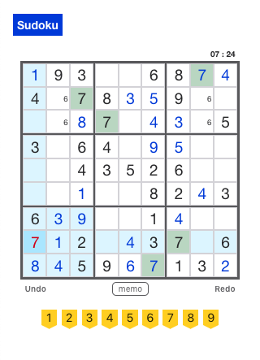

# Sudoku

Sudoku is a full stack web application for the Japanese puzzle game Sudoku.

This is the server-side code for the application with Express and PostgreSQL.

## Live

- [Live Page](https://sudoku-web.now.sh/)

## Client

- [Client Repo](https://github.com/asching7108/sudoku-client/)

## Sudoku Generator

- [Sudoku Generator Repo (Java)](https://github.com/asching7108/sudokuGenerator/)

## Set Up

- Prerequisites:
  - Install PostgreSQL
  - Start PostgreSQL: `pg_ctl -D /usr/local/var/postgres start`
- Clone this repository to your local machine: `git clone REPO-URL NEW-PROJECTS-NAME`
- cd into the cloned repository
- Make a fresh start of the git history for this project: `rm -rf .git && git init`
- Install dependencies: `npm install`
- Create development and test databases: `createdb sudoku`, `createdb sudoku_test`
- Create database user: `createuser sudoku`
- Grant privileges to new user in `psql`:
  - `GRANT ALL PRIVILEGES ON DATABASE sudoku TO sudoku`
  - `GRANT ALL PRIVILEGES ON DATABASE "sudoku-test" TO sudoku`
- Prepare environment file: `cp example.env .env`
- Replace values in `.env` with your custom values
- Replace default values in `src/config.js` with your custom values
- Bootstrap development database: `npm run migrate`
- Bootstrap test database: `npm run migrate:test`

## Sample Data

- To seed the database for development: `psql -U sudoku -d sudoku -a -f seeds/seed.sudoku_tables.sql`
- To clear seed data: `psql -U sudoku -d sudoku -a -f seeds/trunc.sudoku_tables.sql`

## Scripts

- Start application: `npm start`
- Start application for development: `npm run dev`
- Run tests: `npm test`

## Deploy

When ready for deployment, add a new Heroku application with `heroku create`. This will make a new git remote called "heroku" and you can then `npm run deploy` which will push to this remote's master branch. Set environment variables CLIENT_ORIGIN on Heroku: `Heroku config:set CLIENT_ORIGIN="CLIENT-URL"`.

## Features

* Authentication with JWT.
* Allows unauthenticated access (guest users).
* Gets a random sudoku puzzle by level.
* Creates and updates game records, including every moves.

## API Overview
```text
/api
.
├── /auth
│   └── POST
│       ├── /login
│       ├── /refresh
├── /users
│   └── POST
│       ├── /
├── /puzzles
│   └── GET
│       ├── /
├── /records
│   └── GET
│       ├── /
│       ├── /:record_id
│   └── POST
│       ├── /
│       ├── /:record_id/steps
│   └── PATCH
│       ├── /:record_id
│       ├── /:record_id/steps
```

### POST `/api/auth/login`
```js
// req.header
{
  content-type: application/json
}

// req.body
{
  email: String,
  password: String
}

// res.body
{
  authToken: String,
  user_name: String
}
```

### POST `/api/auth/refresh`
```js
// req.header
{
  content-type: application/json
}

// req.header
{
  Authorization: Bearer ${token}
}

// res.body
{
  authToken: String
}
```

### POST `/api/users`
```js
// req.header
{
  content-type: application/json
}

// req.body
{
  email: String,
  password: String,
  user_name: String
}

// res.body
{
  email: String,
  user_name: String
}
```

### GET `/api/puzzles`
```js
// req.header
{
  Authorization: Bearer ${token} (optional)
}

// req.query
{
  level: Integer 1-6
}

// res.body
{
  puzzle_id,
  puzzle: [
    cell_id: Integer 0-80,
    is_default: Boolean,
    value: Integer 1-9
  ]
}
```

### GET `/api/records`
```js
// req.header
{
  Authorization: Bearer ${token} (optional)
}

// res.body
{
  solved: [
    id: record_id,
    puzzle_id,
    user_id,
    num_empty_cells: Integer 0-81,
    num_wrong_cells: Integer 0-81,
    step_id: Integer,
    max_step_id: Integer,
    duration: Integer (seconds),
    date_modified: timestamp
  ],
  not_solved: [
    id: record_id,
    puzzle_id,
    user_id,
    num_empty_cells: Integer 0-81,
    num_wrong_cells: Integer 0-81,
    step_id: Integer,
    max_step_id: Integer,
    duration: Integer (seconds),
    date_modified: timestamp
  ]
}
```

### GET `/api/records/:record_id`
```js
// req.header
{
  Authorization: Bearer ${token} (optional)
}

// res.body
{
  record: {
    id: record_id,
    puzzle_id,
    user_id,
    num_empty_cells: Integer 0-81,
    num_wrong_cells: Integer 0-81,
    step_id: Integer,
    max_step_id: Integer,
    duration: Integer (seconds),
    date_modified: timestamp
  },
  snapshot: [
    {
      cell_id: Integer 0-80,
      is_default: Boolean,
      def_value: Integer 1-9,
      value: Integer 1-9 || null,
      has_conflict: Boolean,
      memos: [
        Boolean, 
        Boolean, 
        Boolean, 
        Boolean, 
        Boolean, 
        Boolean, 
        Boolean, 
        Boolean, 
        Boolean
      ]
    }
  ]
}
```

### POST `/api/records`
```js
// req.header
{
  content-type: application/json,
  Authorization: Bearer ${token} (optional)
}

// req.body
{
  puzzle_id
}

// res.body
{
  record: {
    id: record_id,
    puzzle_id,
    user_id,
    num_empty_cells: Integer 0-81,
    num_wrong_cells: Integer 0-81,
    step_id: Integer,
    max_step_id: Integer,
    duration: Integer (seconds),
    date_modified: timestamp
  },
  snapshot: [
    {
      cell_id: Integer 0-80,
      is_default: Boolean,
      def_value: Integer 1-9,
      value: Integer 1-9 || null,
      has_conflict: Boolean,
      memos: [
        Boolean, 
        Boolean, 
        Boolean, 
        Boolean, 
        Boolean, 
        Boolean, 
        Boolean, 
        Boolean, 
        Boolean
      ]
    }
  ]
}
```

### POST `/api/records/:record_id/steps`
```js
// req.header
{
  content-type: application/json,
  Authorization: Bearer ${token} (optional)
}

// req.body
{
  duration: Integer (seconds),
  steps: [
    {
      cell_id: Integer 0-81,
      step_type: 'BEFORE' || 'AFTER',
      has_conflict: Boolean,
      value: Integer 1-9 || null,
      memos: [
        Boolean, 
        Boolean, 
        Boolean, 
        Boolean, 
        Boolean, 
        Boolean, 
        Boolean, 
        Boolean, 
        Boolean
      ]
    }
  ]
}

// res.body
{
  record: {
    id: record_id,
    puzzle_id,
    user_id,
    num_empty_cells: Integer 0-81,
    num_wrong_cells: Integer 0-81,
    step_id: Integer,
    max_step_id: Integer,
    duration: Integer (seconds),
    date_modified: timestamp
  },
  cells: [  // updated cells
    {
      cell_id: Integer 0-80,
      is_default: Boolean,
      def_value: Integer 1-9,
      value: Integer 1-9 || null,
      has_conflict: Boolean,
      memos: [
        Boolean, 
        Boolean, 
        Boolean, 
        Boolean, 
        Boolean, 
        Boolean, 
        Boolean, 
        Boolean, 
        Boolean
      ]
    }
  ]
}
```

### PATCH `/api/records/:record_id`
```js
// req.header
{
  content-type: application/json,
  Authorization: Bearer ${token} (optional)
}

// req.body
{
  updateCols: Object of columns to update
}

// res.body
{
  record: {
    id: record_id,
    puzzle_id,
    user_id,
    num_empty_cells: Integer 0-81,
    num_wrong_cells: Integer 0-81,
    step_id: Integer,
    max_step_id: Integer,
    duration: Integer (seconds),
    date_modified: timestamp
  }
}
```

### PATCH `/api/records/:record_id/steps`
```js
// req.header
{
  content-type: application/json,
  Authorization: Bearer ${token} (optional)
}

// req.body
{
  duration: Integer (seconds),
  edit_type: 'UNDO' || 'REDO'
}

// res.body
{
  record: {
    id: record_id,
    puzzle_id,
    user_id,
    num_empty_cells: Integer 0-81,
    num_wrong_cells: Integer 0-81,
    step_id: Integer,
    max_step_id: Integer,
    duration: Integer (seconds),
    date_modified: timestamp
  },
  cells: [  // updated cells
    {
      cell_id: Integer 0-80,
      is_default: Boolean,
      def_value: Integer 1-9,
      value: Integer 1-9 || null,
      has_conflict: Boolean,
      memos: [
        Boolean, 
        Boolean, 
        Boolean, 
        Boolean, 
        Boolean, 
        Boolean, 
        Boolean, 
        Boolean, 
        Boolean
      ]
    }
  ]
}
```

## Sample Client Screenshots



## Technologies

* Node.js
* Express
* PostgreSQL
* JavaScript
* JWT
* Chai & Mocha